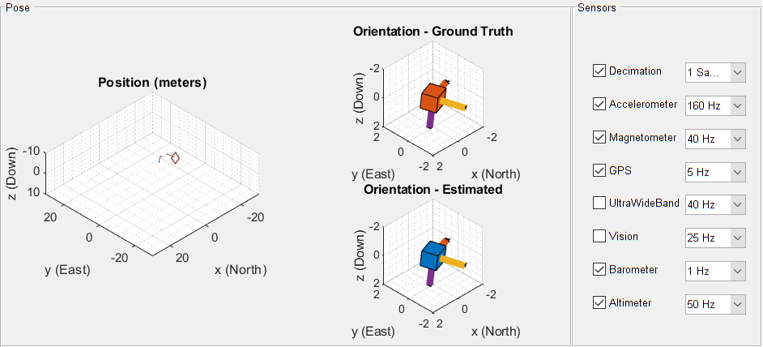

# SGN Project: UAV Sensor Fusion

## SCRIPTS
- `main_1`:\
	Simulate an UAV trajectory and plot the orientation and position errors, in addition to the estimated and real position and orientation. \
	It is possible to activate and deactivate the various sensors, and to change on the fly their sampling rate.
	
- `main_2`:\
	Generate a waypoint trajectory in a semi-structured environment (manually created) and visualize the estimate of the position of the drone.\
	Several scenarios are available and selectable before the real simulation starts.

	Once the trajectory (not the scenario) has been changed it is necessary to recreate it by selecting the correct choice in the corresponding questdlg.\
	Once this has been done, if there are no further changes in the trajectory, for later simulation it can be reused by loading the saved trajectory data (this avoids the slow trajectory generation process).
	
- `main_3`:
	Generate a coil trajectory. This trajectory is useful when there are unknown UWB beacons and no other absolute position sensors available.\
	This type of trajectory allows the system to estimate the UWB anchor position and at the same time use them for navigation (SLAM). The beacon position is first be initialized with an appropriate algorithm.
	

## Custom MATLAB System Objects developed
Note: "stepImpl"(...) means that it is the predefined method, executed for the system object istance named xxx with: xxx(...)

	my_navigation_filter
	my_navigation_filter_adaptive
		Fusion of accelerometer, gyroscope, magnetometer, GPS (position and velocity), UWB (with known and unknown beacons), computer vision (ArUco markers with known and unknown positions), barometer and altimeter.
		Indirect Quaternion-Based Sequential Extended Kalman Filter

		Usage:
			create the sys obj -> set all the states -> use private_properties_update() -> use "stepImpl"(1) to finish the initialization
			When some parameters are edited online, it is sometimes necessary to use again private_properties_update() 

		Public methods:
			set_initial_state(varargin)
			[q, p] = get_pose()
			predict(gyro_meas, acc_meas)
			z_g = fuse_accel()
			z_m = fuse_magn(magn_meas)
			z_GPS = fuse_GPS(GPS_pos_meas, GPS_vel_meas)
			z_uwb = fuse_uwb(uwb_meas, id)
			[beacon_pos, z_uwb] = fuse_unknown_uwb(uwb_meas, id)
			[z_vis, n_meas] = fuse_vis(Tmc, id)
			z_bar = fuse_bar(bar_meas)
			z_alt = fuse_alt(alt_meas)
			private_properties_update()
	detect_marker

		Public methods:
			[q_corr, p_corr, v_corr] = "stepImpl"(Tcm, id, p_bn_n, q_bn, fcnt)
	altimeter_sensor

		Public methods:
			h_meas = "stepImpl"(pos, q, ground_height)
	aruco_vision_sensor

		Public methods:
			[Tcm, id, visualized_markers_index] = "stepImpl"(p_bg_g, q)
	barometer_sensor

		Public methods:
			h = "stepImpl"(pos)
	uwb_sensor

		Public methods:
			[dist, id, index2] = "stepImpl"(target_position, input_id)

